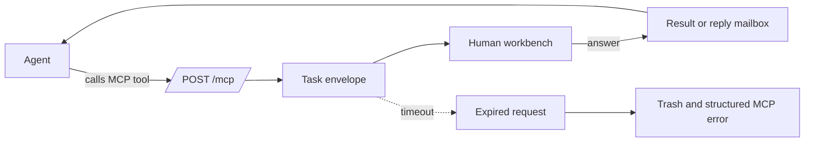

# humen-mcp

<div align="center">
  

  <h3>Ask a real human from an MCP tool call.</h3>

  <p>
    A human-in-the-loop MCP server for moments where agents need judgment, visual review, account-bound action, or a short escalation path.
  </p>

  <p>
    <a href="README.md">English</a>
    ·
    <a href="README.zh-CN.md">简体中文</a>
    ·
    <a href="#why-people-care">Why it matters</a>
    ·
    <a href="#online-panel">Online panel</a>
    ·
    <a href="#deploy-with-an-agent">Deploy</a>
    ·
    <a href="#security-model">Security</a>
    ·
    <a href="#technical-details">Technical details</a>
  </p>
</div>

<p align="center">
  <a href="https://github.com/LIghtJUNction/humen-mcp/actions/workflows/release.yml"></a>
  <a href="https://github.com/LIghtJUNction/humen-mcp/releases"></a>
  <a href="Cargo.toml"></a>
  <a href="Cargo.toml"></a>
  <a href="https://modelcontextprotocol.io/"></a>
  <a href="Cargo.toml"></a>
  <a href="humen-mcp-webui/package.json"></a>
  <a href="humen-mcp-webui/package.json"></a>
  <a href="#deploy-with-an-agent"></a>
  <a href="#security-model"></a>
</p>

`humen-mcp` lets an agent ask a logged-in person for help without leaving the MCP loop. The agent calls a tool, the server creates a task, the human answers in the web UI, and the agent receives the result.

Use it when a workflow needs a person for one small but important step: choosing between options, reading an image, checking a website, retrieving an account-bound code, approving a risky action, or escalating an ambiguous decision.

For Simplified Chinese documentation, see [README.zh-CN.md](README.zh-CN.md).

## Online Panel

| Purpose | URL |
| --- | --- |
| Human workbench | <https://humen.lmm.best/mcp/> |
| MCP endpoint | <https://humen.lmm.best/mcp> |

Use the trailing slash for the browser panel: `/mcp/`. Use the no-trailing-slash endpoint for MCP JSON-RPC: `/mcp`.

## Login And Registration

Use **GitHub OAuth** to register and log in to the public panel at <https://humen.lmm.best/mcp/>. More login methods can be added later.

Normal users do not need a password. There is no ordinary user password to remember, store, or leak. After logging in, users can add a passkey and use passwordless sign-in on supported devices.

Email/password login is only for the administrator account. The admin password is a strong private secret and should not be published in README, issues, screenshots, examples, or user-facing setup guides.

## Why People Care

| When the agent hits this | `humen-mcp` gives it this |
| --- | --- |
| Needs judgment, not more tokens | A typed human task with title, prompt, choices, image, steps, and timeout |
| Needs a real account holder | A logged-in human workbench with identity, presence, and answer history |
| Cannot wait inside one request | Async task creation plus later polling with `read_humen_replies` |
| Needs the right human | Profiles, tags, friends, online status, and reputation-aware discovery |
| Needs new collaboration patterns | Community plugin manifests for request templates, route strategies, scoring rules, and third-party channels |
| Needs operational deployment | Rust server, React UI, systemd, nginx, AUR packages, and release workflow |

## How It Feels



The important design choice: the agent does not directly control a person. It creates a bounded task envelope with a type, owner, prompt, timeout, and lifecycle.

## Most Interesting Parts

| Piece | Why it is useful |
| --- | --- |
| High-value shortcuts | `approve`, `judge`, and `feedback` cover the common agent escalations without making callers pick a task kind. |
| Blocking and async asks | Use `ask_humen` when the agent should wait; use `ask_humen_*_async` when the agent should keep moving. |
| Typed tasks | Text, choice, yes/no judgment, image review, and step-by-step tasks get clearer UI than a single free-form prompt. |
| Human directory | Agents can discover online humans by profile, tag, friend graph, and reputation, subject to server visibility rules. |
| Community plugins | Load request templates, route strategies, scoring rules, and external channel declarations from plugin manifests. |
| Agent-bound identity | Each human has an agent secret, so MCP requests are tied back to a specific human account instead of a global anonymous token. |
| Practical server packaging | The repo includes nginx routing, systemd units, Arch/AUR packaging, release artifacts, and admin-triggered updates. |

## Deploy With An Agent

Copy this command, run it anywhere with internet access, then send the fetched prompt to the agent that will deploy `humen-mcp` on your server:

```bash
curl -fsSL https://raw.githubusercontent.com/LIghtJUNction/humen-mcp/main/docs/AGENT_DEPLOY_PROMPT.md
```

The prompt tells the agent to inspect the server, install the package, configure `/mcp`, verify the MCP endpoint, and keep admin secrets out of public output.

<details>
<summary><strong>Manual Server Deployment Guide</strong></summary>

This is the short human-run path for an Arch Linux server. See [docs/DEPLOYMENT.md](docs/DEPLOYMENT.md) for the longer deployment note.

1. Install the package:

```bash
paru -S humen-mcp-git
# or, after a GitHub Release exists:
paru -S humen-mcp-bin
```

2. Initialize the private admin login:

```bash
sudo humen-mcp init-admin --email <admin-email>
sudoedit /etc/humen-mcp.env
```

3. Set the public URL and packaged web directory:

```bash
HUMEN_PUBLIC_BASE_URL=https://your-domain.example/mcp
HUMEN_WEB_DIST=/usr/share/humen-mcp/web
```

4. Enable GitHub OAuth for normal users by setting the GitHub client id and secret in `/etc/humen-mcp.env`:

```bash
HUMEN_GITHUB_CLIENT_ID=<github-oauth-client-id>
HUMEN_GITHUB_CLIENT_SECRET=<github-oauth-client-secret>
```

5. Start the service:

```bash
sudo systemctl enable --now humen-mcp.service
curl -fsS http://127.0.0.1:8787/healthz
```

6. Configure nginx so:

- `location = /mcp` proxies to backend `/mcp` for MCP JSON-RPC.
- `location /mcp/` proxies to the web UI and static assets.

7. Verify:

```bash
curl -fsS https://your-domain.example/mcp/api/auth/config
curl -i https://your-domain.example/mcp/
```

The panel should load at `https://your-domain.example/mcp/`. Normal users should register with GitHub OAuth, then optionally add a passkey.

</details>

## Security Model

`humen-mcp` is designed to make the trust boundary explicit: agents may request help, but humans, admins, and server policy decide what is visible and who may act.

| Boundary | Mechanism |
| --- | --- |
| Agent access | MCP calls require a per-human agent secret through `x-humen-agent-secret` or `Authorization: Bearer ...`. |
| Human access | Normal users log in with GitHub OAuth and can add passkeys for passwordless sign-in. |
| Admin access | Admin APIs call `require_admin`; email/password login is reserved for the administrator and should stay private. |
| Directory privacy | Agent directory visibility defaults to `self_only`; optional modes expose friends, public users, or users above a reputation threshold. |
| Reserved identity | `#admin` is reserved. Users and agents cannot assign it through profiles or task text. |
| Task containment | Requests have typed payloads, required title/prompt validation, normalized choices/tags, and server-clamped timeouts. |
| Runtime containment | The packaged service runs as the `humen-mcp` user with `ProtectSystem=strict`, `ProtectHome=true`, and write access limited to `/var/lib/humen-mcp`. |
| Self-update containment | The web UI can only trigger a configured update command. Packaged sudoers limits this to starting `humen-mcp-self-update.service`. |
| Secret hygiene | Ordinary users have no password to leak. Session tokens are stored in memory as SHA-256 hashes keyed by `HUMEN_SESSION_SECRET`; OAuth client secrets are not returned by public config APIs. |

Human answers are still input. Treat them like any other external result: validate before using them for destructive actions, run the service behind HTTPS, and protect `/etc/humen-mcp.env`.

## Technical Details

The rest is folded so the README stays readable. Open only what you need.

<details>
<summary><strong>What It Provides</strong></summary>

- MCP JSON-RPC endpoint at `/mcp`.
- Human workbench web UI served under `/mcp/`.
- Rust backend with REST APIs and WebSocket updates.
- Bun/Vite/React frontend in the `humen-mcp-webui` git submodule.
- Blocking and async human request tools for text, choice, yes/no judgment, image review, and step-by-step tasks.
- Per-human agent access secrets, public profiles, tags, friends, reputation, reports, and online presence.
- Community plugin manifests loaded from `HUMEN_PLUGIN_DIR`, with SDK types published as `humen-mcp-sdk`.
- AUR packages for Arch Linux:
  - `humen-mcp-git`: builds from GitHub source.
  - `humen-mcp-bin`: installs a GitHub Release tarball.
- Admin-only password login, GitHub OAuth registration for normal users, and passkey sign-in support.
- Live presence count and persisted active periods in the users JSON file.
- Request envelope lifecycle: pending, answered, expired, trash, plus persisted late replies for async tools.

</details>

<details>
<summary><strong>Important Paths</strong></summary>

| Purpose | Path |
| --- | --- |
| MCP endpoint | `/mcp` |
| Web UI | `/mcp/` |
| Local backend bind | `127.0.0.1:8787` by default |
| Packaged web dist | `/usr/share/humen-mcp/web` |
| Service env file | `/etc/humen-mcp.env` |
| User/activity store | `/var/lib/humen-mcp/users.json` |
| SQLite store | `/var/lib/humen-mcp/humen-mcp.sqlite3` |
| systemd unit | `humen-mcp.service` |
| self-update unit | `humen-mcp-self-update.service` |

`GET /mcp` is intentionally not the UI; it returns a method warning. Open the UI at `/mcp/` with the trailing slash.

</details>

<details>
<summary><strong>Local Development</strong></summary>

```bash
cp env.example .env
cargo run
```

Build the frontend inside the submodule:

```bash
cd humen-mcp-webui
bun install
bun run build
```

Then restart the backend. For local dev, `HUMEN_WEB_DIST=./humen-mcp-webui/dist` is fine.

Useful checks:

```bash
cargo test
cargo check
cd humen-mcp-webui && bun run build
curl -fsS http://127.0.0.1:8787/healthz
```

</details>

<details>
<summary><strong>MCP Tools</strong></summary>

Implemented MCP methods:

- `initialize`
- `notifications/initialized`
- `tools/list`
- `tools/call`

Current tools include:

| Tool | Purpose |
| --- | --- |
| `approve` | Ask for human approval or denial before a proposed action and wait for the answer. |
| `judge` | Ask for a human yes/no judgment and wait for the answer. |
| `feedback` | Ask for short free-form human feedback and wait for the answer. |
| `ask_humen` | Create a human request and wait for the answer. |
| `ask_humen_async` | Create a human request and return a `request_id` immediately. |
| `ask_humen_text_async` | Create a non-blocking text-answer request. |
| `ask_humen_choice_async` | Create a non-blocking choice request. |
| `ask_humen_judgment_async` | Create a non-blocking yes/no judgment request. |
| `read_humen_replies` | Read completed replies for the user attached to this agent secret. |
| `create_humen_task` | Create a visible AI task for the human account attached to this agent secret. |
| `list_humen_tasks` | List AI-created tasks for the attached human account. |
| `list_agent_inbox` | List pending human-to-agent messages, including friend requests and ask-me prompts. |
| `request_human_friend` | Send a friend request from this connected agent to a visible human. |
| `accept_human_friend` | Accept a human's pending friend request to this connected agent. |
| `list_online_humens` | List online human operators and public profiles visible to this agent. |
| `search_humen_profiles` | Search visible human profiles by text or `#tag`. |
| `list_humen_tags` | List visible `#tag` usage counts. |
| `rate_humen` | Rate a human from 0 to 10; feedback is weighted by the rater's own reputation. |
| `report_humen` | Report a human to the administrator mailbox and apply a zero-score weighted feedback signal from this actor. |
| `list_humen_plugins` | List loaded community plugins and their request templates, route strategies, scoring rules, and channels. |
| `create_humen_request_from_template` | Create an async human request from a plugin request template. |

`approve`, `judge`, and `feedback` are blocking convenience wrappers over `ask_humen`. Use the `ask_humen_*_async` tools and `read_humen_replies` when the agent should continue work while the human answers.

Reputation is a weighted trust score, not a raw average. GitHub OAuth seeds an initial prior from public account signals such as account age, public repositories, sampled stars, follower count, source-repo ratio, and recent activity. Each rating is weighted by the rater's current reputation, repeated ratings from the same actor update the prior rating, and reports create an audit entry plus a zero-score feedback signal. Profile and leaderboard responses include a public `reputation_breakdown` with seed source, seed weight, feedback weight, total weight, and confidence so agents can rank humans without guessing how much evidence backs the score.

### `ask_humen`

`ask_humen` accepts simple human tasks:

```json
{
  "kind": "choice|judgment|text|image_review|steps",
  "title": "Short task title",
  "prompt": "What the human should do",
  "choices": ["A", "B"],
  "image_url": "https://...",
  "image_base64": "iVBORw0KGgo...",
  "image_mime_type": "image/png",
  "steps": ["Open the site", "Read the SMS code"],
  "timeout_seconds": 60,
  "background": false
}
```

Image review tasks may use either `image_url` or `image_base64`. `image_base64` may be raw base64 bytes or a full `data:image/...;base64,...` URL. When raw base64 is used, `image_mime_type` defaults to `image/png`.

`timeout_seconds` is agent-configurable. If omitted, the backend uses 60 seconds. Values are clamped by the server before the envelope is created. The blocking tool waits for the answer. The async tools return a `request_id` immediately; poll `read_humen_replies` to collect completed replies.

The backend creates an envelope:

```json
{
  "id": "...",
  "title": "...",
  "prompt": "...",
  "kind": "text",
  "created_at": 1000,
  "timeout_seconds": 60,
  "expires_at": 1060
}
```

If the human does not answer in time, the request is removed from pending, added to trash, and the MCP caller receives a structured error:

```json
{
  "code": -32001,
  "message": "Human request timed out after 60 seconds",
  "data": {
    "request_id": "...",
    "title": "...",
    "timeout_seconds": 60,
    "expired_at": 1060,
    "suggestion": "Try again with a longer timeout or simplify the request."
  }
}
```

Example payloads are in `examples/`; `examples/README.md` maps each file to the
current MCP tool schema.

Tags are normalized to lowercase `#tag` values. `#admin` is a reserved tag: clients and agents cannot assign it through profile updates or task text, and the backend only derives it for the configured admin identity.

### Community Plugins

Plugins are declarative JSON or TOML manifests loaded at startup from
`HUMEN_PLUGIN_DIR`. A manifest can contribute request templates, route
strategies, scoring rules, and third-party channel declarations. The server
exposes loaded plugins through `list_humen_plugins`, and agents can create an
async request from a template with `create_humen_request_from_template`.

Template ids use `plugin-id/template-id`. Template text supports simple
`{{variable}}` substitution from the tool call's `variables` object. Plugin
authors can use the published `humen-mcp-sdk` crate to build and validate
manifests before distribution.

Example manifest: [examples/community-release-plugin.json](examples/community-release-plugin.json).

</details>

<details>
<summary><strong>HTTP and WebSocket API</strong></summary>

Authenticated UI APIs:

- `GET /api/me`
- `GET /api/me/profile`
- `POST /api/me/profile`
- `GET /api/passkeys`
- `POST /api/passkeys/register/start`
- `POST /api/passkeys/register/finish`
- `POST /api/passkeys/{id}/delete`
- `GET /api/agent/access`
- `POST /api/agent/secret`
- `GET /api/requests`
- `POST /api/requests/{id}/answer`
- `GET /api/sent`
- `GET /api/tasks`
- `POST /api/tasks/{id}/status`
- `GET /api/trash`
- `POST /api/trash/clear`
- `GET /api/users/online`
- `GET /api/users/search?q=...`
- `POST /api/humans/rate`
- `POST /api/humans/report`
- `GET /api/leaderboard`
- `GET /api/tags`
- `GET /api/friends`
- `POST /api/friends`
- `POST /api/friends/{email}/accept`
- `POST /api/friends/{email}/remove`
- `GET /api/ws`

Admin APIs:

- `GET /api/admin/users`
- `POST /api/admin/users`
- `POST /api/admin/users/{email}`
- `POST /api/admin/users/{email}/kick`
- `GET /api/admin/reports`
- `GET /api/admin/settings`
- `POST /api/admin/settings`
- `GET /api/admin/update`
- `POST /api/admin/update`
- `GET /api/admin/webhooks`
- `POST /api/admin/webhooks`

WebSocket events:

```json
{ "type": "request_created", "request": {} }
{ "type": "request_answered", "id": "...", "answer": {} }
{ "type": "request_expired", "id": "...", "expired_request": {} }
{ "type": "trash_cleaned", "removed_count": 1 }
{ "type": "presence_changed", "online_count": 1 }
```

</details>

<details>
<summary><strong>Configuration</strong></summary>

`env.example` documents all supported variables. Important production values:

```bash
HUMEN_BIND=127.0.0.1:8787
HUMEN_PUBLIC_BASE_URL=https://your-domain.example/mcp
HUMEN_WEB_DIST=/usr/share/humen-mcp/web
HUMEN_USERS_FILE=/var/lib/humen-mcp/users.json
HUMEN_DB_FILE=/var/lib/humen-mcp/humen-mcp.sqlite3
HUMEN_ADMIN_EMAIL=<admin-email>
HUMEN_ADMIN_PASSWORD=<generated-admin-password>
HUMEN_SESSION_SECRET=<generated-session-secret>
HUMEN_TRASH_RETENTION_SECONDS=604800
HUMEN_CLEANUP_INTERVAL_SECONDS=60
HUMEN_SELF_UPDATE_COMMAND=/usr/bin/sudo -n /usr/bin/systemctl start humen-mcp-self-update.service
HUMEN_SELF_UPDATE_TIMEOUT_SECONDS=30
HUMEN_PLUGIN_DIR=/etc/humen-mcp/plugins
```

Production note: after AUR install, make sure `/etc/humen-mcp.env` uses the packaged web directory:

```bash
HUMEN_WEB_DIST=/usr/share/humen-mcp/web
```

If this is left as `./humen-mcp-webui/dist`, `https://your-domain.example/mcp/` will return 404 because the service runs from `/var/lib/humen-mcp`.

</details>

<details>
<summary><strong>Arch Deployment</strong></summary>

Install with an AUR helper as a normal user, not root:

```bash
paru -S humen-mcp-git
# or, after a GitHub Release exists:
paru -S humen-mcp-bin
```

On servers where the AUR user is `arch`, use a login shell:

```bash
sudo -iu arch paru -S humen-mcp-git
```

Avoid `sudo -u arch paru ...`; it can inherit root's working directory/git environment and fail with errors like `fatal: error reading '/root/.git'`.

Initialize or reset the admin account:

```bash
sudo humen-mcp init-admin --email <admin-email>
sudoedit /etc/humen-mcp.env
sudo systemctl enable --now humen-mcp.service
```

The `init-admin` command writes `/etc/humen-mcp.env`, generates a new session secret, and prints the generated admin password. Save that password in your password manager; do not commit it.

Packaged installs include admin-triggered self-update support. The web UI calls `POST /api/admin/update`; the service then starts `humen-mcp-self-update.service` through a sudoers rule limited to that exact systemctl command. The oneshot unit runs the configured AUR helper as the normal AUR user, upgrades `humen-mcp-bin` or `humen-mcp-git`, reloads systemd, and restarts `humen-mcp.service`.

Override updater defaults in `/etc/humen-mcp-update.env` when needed:

```bash
HUMEN_UPDATE_AUR_USER=arch
HUMEN_UPDATE_HELPER=paru
HUMEN_UPDATE_PACKAGE=humen-mcp-bin
```

Because the updater runs from systemd without a TTY, the AUR user must be able to run its package installation step non-interactively, for example with `sudo -n true` succeeding for that user.

After editing `/etc/humen-mcp.env`:

```bash
sudo systemctl restart humen-mcp.service
```

</details>

<details>
<summary><strong>Nginx Reverse Proxy</strong></summary>

Include `packaging/nginx/humen-mcp.conf` in the HTTPS server block for your domain.

Required behavior:

- `location = /mcp` proxies to backend `/mcp` for JSON-RPC.
- `location /mcp/` proxies to backend `/` for the web UI and static assets.
- `location /` may redirect to `/mcp/`.

Example verification:

```bash
sudo nginx -t
sudo systemctl reload nginx
curl -i https://your-domain.example/mcp/
curl -fsS https://your-domain.example/mcp/api/auth/config
```

A working `/mcp/` response should be `HTTP 200` with the web UI HTML.

</details>

<details>
<summary><strong>Verification Checklist</strong></summary>

After install or upgrade:

```bash
pacman -Q humen-mcp-git humen-mcp-bin 2>/dev/null || true
humen-mcp --version
systemctl is-active humen-mcp.service
curl -fsS http://127.0.0.1:8787/healthz
curl -fsS http://127.0.0.1:8787/mcp \
  -H 'content-type: application/json' \
  --data @examples/mcp-tools-list.json
curl -i https://your-domain.example/mcp/
```

Expected:

- service is `active`
- health returns `{"ok":true}`
- `tools/list` includes `ask_humen`
- `/mcp/` returns the web UI HTML, not 404

</details>

<details>
<summary><strong>Release Packaging</strong></summary>

Build a binary release tarball:

```bash
scripts/package-release.sh
# or explicitly:
scripts/package-release.sh <version>
```

With no argument, the script reads the version from `Cargo.toml`. If an explicit
version does not match `Cargo.toml`, packaging fails instead of producing a
misnamed tarball.

Or publish through GitHub Actions:

```bash
git tag v<version>
git push origin v<version>
```

The `Release` workflow can also be run manually from GitHub Actions. Its `version` input is optional and defaults to `auto`, which uses the version in `Cargo.toml`. The GitHub Release tag is always `v<version>`. It builds the Rust binary and web UI, uploads the tarball plus `.sha256` as workflow artifacts, and creates or updates that GitHub Release.

The tarball is written to `dist-release/` and contains:

- `humen-mcp`
- `web/`
- `packaging/systemd/humen-mcp.service`
- `packaging/systemd/humen-mcp-self-update.service`
- `packaging/scripts/humen-mcp-self-update`
- `packaging/sudoers/humen-mcp-self-update`
- `packaging/sysusers/humen-mcp.conf`
- `packaging/tmpfiles/humen-mcp.conf`
- `env.example`

For `humen-mcp-bin`, upload the tarball to GitHub Release `v<version>`, then update `aur/humen-mcp-bin/PKGBUILD` and `.SRCINFO` with the new version and sha256.

</details>

<details>
<summary><strong>Troubleshooting</strong></summary>

### `https://domain/mcp/` returns 404

Check backend root first:

```bash
curl -i http://127.0.0.1:8787/
```

If it is also 404, inspect the running service environment:

```bash
pid=$(systemctl show -p MainPID --value humen-mcp.service)
sudo tr '\0' '\n' < /proc/$pid/environ | grep HUMEN_WEB_DIST
```

Fix `/etc/humen-mcp.env`:

```bash
HUMEN_WEB_DIST=/usr/share/humen-mcp/web
```

Then restart:

```bash
sudo systemctl restart humen-mcp.service
```

### AUR build says it is reading `/root/.git`

Run `paru` through a login shell for the normal AUR user:

```bash
sudo -iu arch bash -lc 'unset GIT_DIR GIT_WORK_TREE; cd ~; paru -S humen-mcp-git'
```

### Admin login still shows `<admin-email>`

The admin account was not initialized. Run:

```bash
sudo humen-mcp init-admin --email <admin-email>
sudo systemctl restart humen-mcp.service
```

</details>
