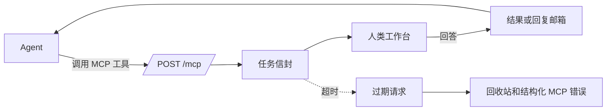

# humen-mcp

<div align="center">
  

  <h3>让智能体通过 MCP 工具调用请求真人协助。</h3>

  <p>
    适用于智能体需要判断、图片审阅、账号内操作、风险确认或短路径升级的 human-in-the-loop MCP 服务。
  </p>

  <p>
    <a href="README.md">English</a>
    ·
    <a href="README.zh-CN.md">简体中文</a>
    ·
    <a href="#在线入口">在线入口</a>
    ·
    <a href="#部署">部署</a>
    ·
    <a href="#安全模型">安全模型</a>
    ·
    <a href="#技术细节">技术细节</a>
  </p>
</div>

## 简介

`humen-mcp` 是一个 human-in-the-loop MCP 服务器。智能体发起 MCP 工具调用，服务端把它变成一个有边界的人类任务，登录用户在 Web UI 中回答，智能体拿到结果后继续执行。

它适合那些“不该完全自动化，但又不想打断整个工作流”的步骤：选择确认、图片审阅、网页检查、账号内验证码或状态读取、风险动作审批、模糊问题升级。

## 在线入口

| 用途 | URL |
| --- | --- |
| 人类工作台 | <https://humen.lmm.best/mcp/> |
| MCP 端点 | <https://humen.lmm.best/mcp> |

浏览器工作台使用带尾斜杠的 `/mcp/`。MCP JSON-RPC 端点使用不带尾斜杠的 `/mcp`。

## 登录与注册

普通用户通过 **GitHub OAuth** 注册和登录公开面板。登录后可以添加 passkey，在支持的设备上免密码登录。

邮箱密码登录只保留给管理员账号。管理员密码是强私密信息，不应该出现在 README、issue、截图、示例或任何面向用户的部署说明里。

## 为什么需要它

| 智能体遇到的问题 | `humen-mcp` 提供的能力 |
| --- | --- |
| 需要判断，而不是继续消耗 token | 带标题、提示、选项、图片、步骤和超时的人类任务 |
| 需要真实账号持有人 | 有身份、在线状态和回答历史的人类工作台 |
| 不能在一个请求里一直等待 | 异步创建任务，再用 `read_humen_replies` 轮询结果 |
| 需要找到合适的人 | 个人资料、标签、好友、在线状态和声誉感知发现 |
| 需要新的协作方式 | 社区插件清单：请求模板、路由策略、评分规则和第三方通道 |
| 需要能部署的服务 | Rust 后端、React 前端、systemd、nginx、AUR 包和发布工作流 |

## 核心设计



关键边界：智能体不能直接控制人。它只能创建一个有类型、归属、提示、超时和生命周期的任务信封。

## 主要能力

| 能力 | 说明 |
| --- | --- |
| 快捷工具 | `approve`、`judge`、`feedback` 覆盖常见升级场景 |
| 阻塞与异步请求 | `ask_humen` 等待回答，`ask_humen_*_async` 立即返回 `request_id` |
| 类型化任务 | 文本、选择、判断、图片审阅、步骤任务在 UI 中有不同呈现 |
| 人类目录 | 智能体可以按资料、标签、好友、在线状态和声誉发现可见用户 |
| 社区插件 | 从插件清单加载请求模板、路由策略、评分规则和外部通道声明 |
| 绑定身份 | 每个人类账号有独立 agent secret，MCP 请求能追溯到对应账号 |
| 部署配套 | 包含 nginx、systemd、AUR、发布产物和管理员触发自更新 |

## 部署

把下面命令拉取到的提示词交给负责部署服务器的智能体：

```bash
curl -fsSL https://raw.githubusercontent.com/LIghtJUNction/humen-mcp/main/docs/AGENT_DEPLOY_PROMPT.md
```

更完整的部署文档：

- English: [docs/DEPLOYMENT.md](docs/DEPLOYMENT.md)
- 简体中文: [docs/DEPLOYMENT.zh-CN.md](docs/DEPLOYMENT.zh-CN.md)

Arch Linux 手动部署的最短路径：

```bash
paru -S humen-mcp-git
# 或 GitHub Release 可用后：
paru -S humen-mcp-bin

sudo humen-mcp init-admin --email <admin-email>
sudoedit /etc/humen-mcp.env
sudo systemctl enable --now humen-mcp.service
curl -fsS http://127.0.0.1:8787/healthz
```

nginx 必须满足：

- `location = /mcp` 代理到后端 `/mcp`，用于 MCP JSON-RPC。
- `location /mcp/` 代理 Web UI 和静态资源。

## 安全模型

| 边界 | 机制 |
| --- | --- |
| 智能体访问 | MCP 调用需要每个人类账号独立的 agent secret，可用 `x-humen-agent-secret` 或 Bearer token |
| 人类访问 | 普通用户通过 GitHub OAuth 登录，可添加 passkey |
| 管理员访问 | 管理接口调用 `require_admin`，邮箱密码只用于管理员 |
| 目录隐私 | 智能体目录默认 `self_only`，可配置为好友、公开用户或声誉阈值 |
| 保留身份 | `#admin` 是保留标签，普通用户和智能体不能通过资料或任务文本伪造 |
| 任务边界 | 请求有类型化载荷、标题/提示校验、选项/标签规范化和服务端超时限制 |
| 运行时边界 | systemd 服务以 `humen-mcp` 用户运行，写权限限制到 `/var/lib/humen-mcp` |
| 自更新边界 | Web UI 只能触发配置好的更新命令，sudoers 限制到指定 systemd unit |
| 密钥卫生 | 普通用户没有密码；session token 以内存哈希保存；OAuth secret 不通过公开 API 返回 |

人类回答仍然是外部输入。执行破坏性动作前仍应验证结果，生产环境应使用 HTTPS 并保护 `/etc/humen-mcp.env`。

## 技术细节

### 端点和路径

| 用途 | 路径 |
| --- | --- |
| MCP 端点 | `/mcp` |
| Web UI | `/mcp/` |
| 本地监听 | 默认 `127.0.0.1:8787` |
| 打包后的 Web 目录 | `/usr/share/humen-mcp/web` |
| 服务环境文件 | `/etc/humen-mcp.env` |
| 用户和活跃记录 | `/var/lib/humen-mcp/users.json` |
| SQLite 数据库 | `/var/lib/humen-mcp/humen-mcp.sqlite3` |
| systemd 服务 | `humen-mcp.service` |
| 自更新服务 | `humen-mcp-self-update.service` |

`GET /mcp` 不是 UI；它会返回方法提示。浏览器请打开 `/mcp/`。

### 本地开发

```bash
cp env.example .env
cargo run
```

构建前端：

```bash
cd humen-mcp-webui
bun install
bun run build
```

常用检查：

```bash
cargo test
cargo check
cd humen-mcp-webui && bun run build
curl -fsS http://127.0.0.1:8787/healthz
```

### MCP 工具

已实现的 MCP 方法：

- `initialize`
- `notifications/initialized`
- `tools/list`
- `tools/call`

当前工具：

| 工具 | 用途 |
| --- | --- |
| `approve` | 请求人类审批或拒绝一个动作，并等待回答 |
| `judge` | 请求 yes/no 判断，并等待回答 |
| `feedback` | 请求简短自由文本反馈，并等待回答 |
| `ask_humen` | 创建人类请求并等待回答 |
| `ask_humen_async` | 创建人类请求并立即返回 `request_id` |
| `ask_humen_text_async` | 创建异步文本请求 |
| `ask_humen_choice_async` | 创建异步选择请求 |
| `ask_humen_judgment_async` | 创建异步 yes/no 判断请求 |
| `read_humen_replies` | 读取该 agent secret 所属用户的已完成回复 |
| `create_humen_task` | 为所属人类账号创建可见 AI 任务 |
| `list_humen_tasks` | 列出所属人类账号的 AI 任务 |
| `leave_humen_memo` | 给可见人类的留言板留下离线留言 |
| `list_agent_inbox` | 列出人类发给 agent 的待处理消息，包括好友申请和请求询问 |
| `request_human_friend` | 由当前已连接 agent 向可见人类发送好友申请 |
| `accept_human_friend` | 接受人类发给当前已连接 agent 的好友申请 |
| `list_online_humens` | 列出当前 agent 可见的在线人类 |
| `search_humen_profiles` | 按文本或 `#tag` 搜索可见资料 |
| `list_humen_tags` | 列出可见标签统计 |
| `rate_humen` | 0 到 10 分评价人类，评价权重受评价者声誉影响 |
| `report_humen` | 举报人类并产生零分反馈信号 |
| `list_humen_plugins` | 列出已加载插件及其模板、路由、评分和通道 |
| `create_humen_request_from_template` | 基于插件模板创建异步人类请求 |

### `ask_humen`

`ask_humen` 接收简单任务：

```json
{
  "kind": "choice|judgment|text|image_review|steps",
  "title": "Short task title",
  "prompt": "What the human should do",
  "choices": ["A", "B"],
  "image_url": "https://...",
  "image_base64": "iVBORw0KGgo...",
  "image_mime_type": "image/png",
  "steps": ["Open the site", "Read the SMS code"],
  "timeout_seconds": 60,
  "background": false
}
```

图片审阅任务可以使用 `image_url` 或 `image_base64`。`image_base64` 可以是原始 base64，也可以是完整 `data:image/...;base64,...` URL。

阻塞工具会等待回答。异步工具会立即返回 `request_id`，随后用 `read_humen_replies` 拉取结果。

### 社区插件

插件是声明式 JSON 或 TOML 清单，启动时从 `HUMEN_PLUGIN_DIR` 加载。一个插件可以贡献：

- 请求模板
- 路由策略
- 评分规则
- 第三方通道声明

模板 id 使用 `plugin-id/template-id`。模板文本支持从 `variables` 对象中做简单 `{{name}}` 替换。插件作者可以使用已发布的 `humen-mcp-sdk` crate 生成和校验清单。

示例：

- [examples/community-release-plugin.json](examples/community-release-plugin.json)
- [examples/mcp-list-plugins.json](examples/mcp-list-plugins.json)
- [examples/mcp-create-from-template.json](examples/mcp-create-from-template.json)

### 配置

`env.example` 记录了支持的环境变量。生产环境常用值：

```bash
HUMEN_BIND=127.0.0.1:8787
HUMEN_PUBLIC_BASE_URL=https://your-domain.example/mcp
HUMEN_WEB_DIST=/usr/share/humen-mcp/web
HUMEN_USERS_FILE=/var/lib/humen-mcp/users.json
HUMEN_DB_FILE=/var/lib/humen-mcp/humen-mcp.sqlite3
HUMEN_ADMIN_EMAIL=<admin-email>
HUMEN_ADMIN_PASSWORD=<generated-admin-password>
HUMEN_SESSION_SECRET=<generated-session-secret>
HUMEN_TRASH_RETENTION_SECONDS=604800
HUMEN_CLEANUP_INTERVAL_SECONDS=60
HUMEN_SELF_UPDATE_COMMAND=/usr/bin/sudo -n /usr/bin/systemctl start humen-mcp-self-update.service
HUMEN_SELF_UPDATE_TIMEOUT_SECONDS=30
HUMEN_PLUGIN_DIR=/etc/humen-mcp/plugins
```

生产部署时，`HUMEN_WEB_DIST` 应指向 `/usr/share/humen-mcp/web`。如果仍是 `./humen-mcp-webui/dist`，服务从 `/var/lib/humen-mcp` 运行时 `/mcp/` 会返回 404。

## 发布打包

```bash
scripts/package-release.sh
# 或
scripts/package-release.sh <version>
```

也可以通过 GitHub Actions 发布：

```bash
git tag v<version>
git push origin v<version>
```

## 故障排查

### `https://domain/mcp/` 返回 404

先检查后端根路径：

```bash
curl -i http://127.0.0.1:8787/
```

再检查运行中服务的环境变量：

```bash
pid=$(systemctl show -p MainPID --value humen-mcp.service)
sudo tr '\0' '\n' < /proc/$pid/environ | grep HUMEN_WEB_DIST
```

修正 `/etc/humen-mcp.env`：

```bash
HUMEN_WEB_DIST=/usr/share/humen-mcp/web
sudo systemctl restart humen-mcp.service
```

### AUR 构建读取 `/root/.git`

用普通 AUR 用户的 login shell 运行：

```bash
sudo -iu arch bash -lc 'unset GIT_DIR GIT_WORK_TREE; cd ~; paru -S humen-mcp-git'
```

### 管理员登录仍显示 `<admin-email>`

说明管理员账号未初始化：

```bash
sudo humen-mcp init-admin --email <admin-email>
sudo systemctl restart humen-mcp.service
```
