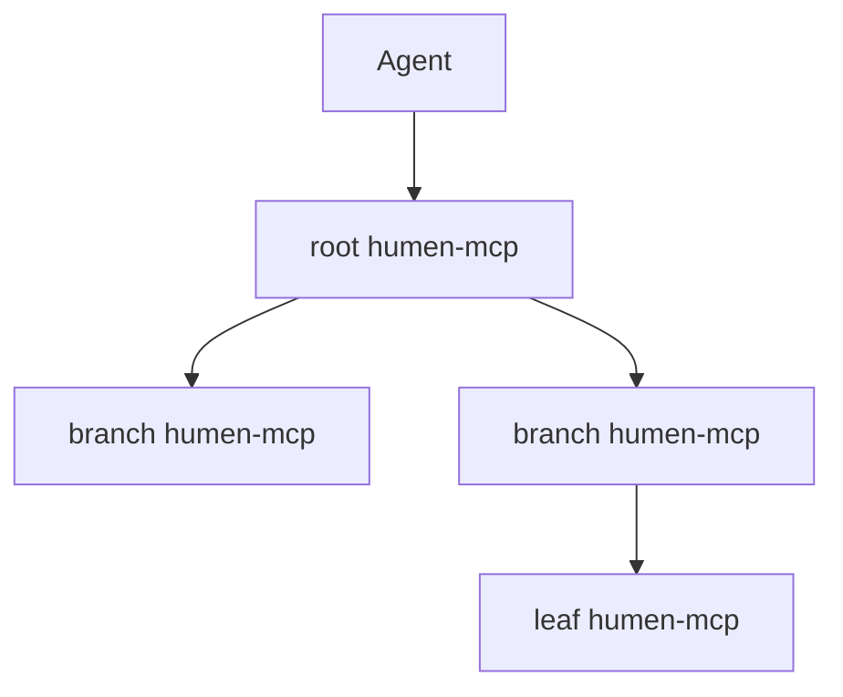

# Architecture

Language: [English](ARCHITECTURE.md) | [简体中文](ARCHITECTURE.zh-CN.md)

`humen-mcp` is a broker between agents and humans.

1. Agent calls MCP `tools/call` for `ask_humen`.
2. Backend validates the MCP payload and creates a pending request envelope with `created_at`, `timeout_seconds`, and `expires_at`.
3. Human logs into the web UI and receives the request over WebSocket plus REST polling fallback, including a live countdown from `expires_at`.
4. Human answers a simple choice, text, image review, or step-following task. Image review requests can reference a remote `image_url` or embed `image_base64` data that the web UI renders as a data URL.
5. Backend resolves the waiting MCP call with the human answer, or writes the
   asynchronous answer to the reply mailbox and emits an MCP reply notification
   when the client has an SSE stream open.

If the envelope expires first, the backend removes it from pending requests, stores it in the in-memory trash bin, sends `request_expired`, and returns JSON-RPC error code `-32001` with request details and a retry suggestion. Trash is retained for `HUMEN_TRASH_RETENTION_SECONDS` and cleaned on `HUMEN_CLEANUP_INTERVAL_SECONDS`.

The first version intentionally keeps pending requests and trash in memory so the full loop is easy to deploy and inspect. User records and WebSocket active periods are persisted in `HUMEN_USERS_FILE`; the next persistence step should add SQLite/Postgres for requests, trash, sessions, and audit events without changing the MCP surface.

## MCP Notifications

Async MCP clients can open `GET /mcp` with `Accept: text/event-stream` and the
same agent secret header used for `POST /mcp`. When a human reply is available,
the server sends a JSON-RPC notification with method
`notifications/humen/reply_available`. The notification only carries the
`request_id` and `read_humen_replies` tool hint; clients still read the full
answer through `read_humen_replies`. Clients that cannot keep the stream open
fall back to polling `read_humen_replies`.

## humen-mcp Network

An instance can act as a root or branch node by declaring downstream
`humen-mcp` nodes in `HUMEN_FEDERATION_FILE`. The config is local to the server;
`list_humen_nodes` returns redacted node summaries and never exposes
`agent_secret`.

The first federation loop is async:

1. Agent calls `ask_humen_network_async` on the root node.
2. Root chooses a downstream node by `target_node_id`, `route_tags`, or `#tag`
   text in the request.
3. Root acts as an MCP client and calls the downstream `/mcp`
   `ask_humen_async`, then stores the local-to-remote request id mapping.
4. Agent later calls root `read_humen_replies`; root first polls downstream
   `read_humen_replies`, copies any answer into the local reply mailbox, then
   returns replies normally.
5. Agent only needs the root-local `request_id` and does not connect directly
   to downstream nodes.

Each edge uses its own downstream agent secret. Federated requests carry a
`path` and `hop_limit` for future multi-hop routing and loop detection. The
current implementation prioritizes direct async forwarding from a root to its
configured children; any branch node can use the same config model to manage
its own children.

### Federation Ledger

Federation borrows the audit shape of blockchains without adopting global
consensus, proof-of-work, or tokens. Each node keeps a local append-only
`federation_ledger` hash chain in SQLite:

- `federated_request_created` when a local request is mapped to a downstream
  remote request id.
- `federated_reply_collected` when a downstream answer is copied into the local
  reply mailbox.
- `federated_request_expired` or `federated_request_failed` when the route does
  not complete.

Every ledger entry stores `previous_hash`, `event_hash`, `event_type`,
`subject_id`, and the event JSON. The event hash covers the previous hash, node
id, event type, subject id, timestamp, and payload, making local history
tamper-evident. Agents can inspect the current head and recent entries with
`read_humen_network_ledger`; `list_humen_nodes` also includes the current local
ledger head.

## Auth

The backend supports:

- Email/password login through `HUMEN_ADMIN_EMAIL` and `HUMEN_ADMIN_PASSWORD`.
- GitHub OAuth endpoints when `HUMEN_GITHUB_CLIENT_ID` and `HUMEN_GITHUB_CLIENT_SECRET` are set.

Production deployment should replace the single configured admin with database-backed users before inviting multiple humans.
