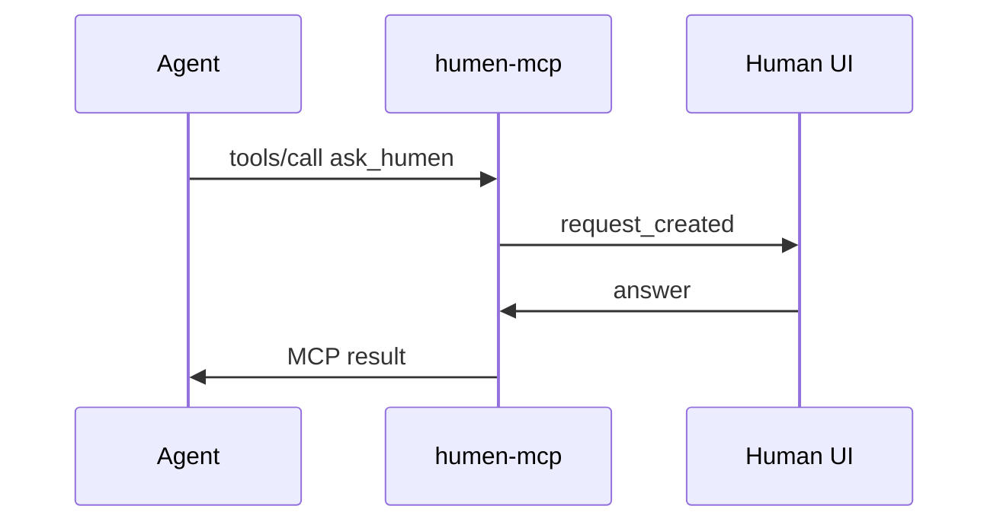
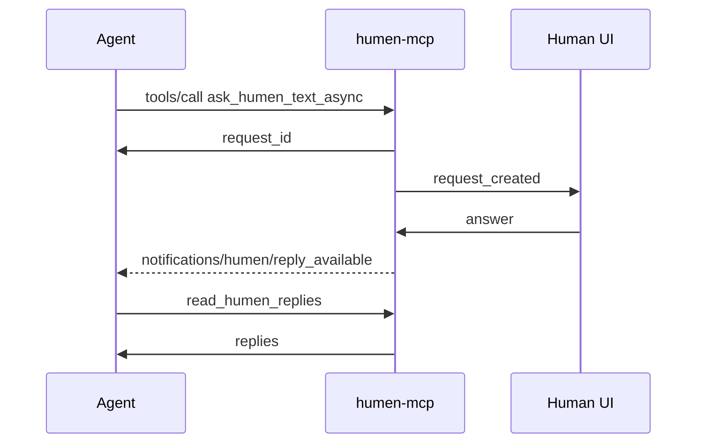
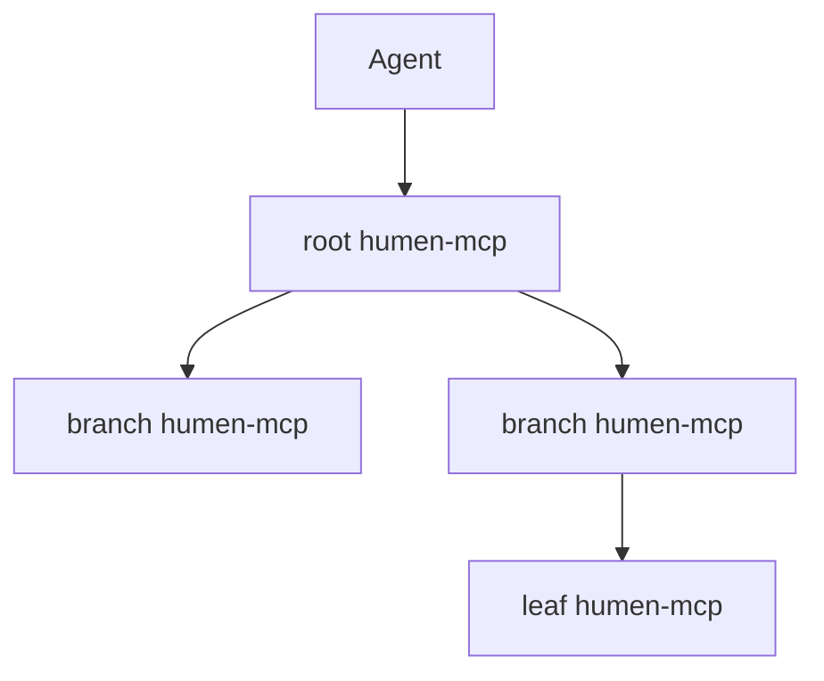

# 架构

语言：[English](ARCHITECTURE.md) | [简体中文](ARCHITECTURE.zh-CN.md)

`humen-mcp` 是智能体和人类之间的 broker。

1. 智能体通过 MCP `tools/call` 调用 `ask_humen` 或异步工具。
2. 后端校验 MCP 载荷，创建 pending 请求信封，包含 `created_at`、`timeout_seconds` 和 `expires_at`。
3. 人类登录 Web UI，通过 WebSocket 和 REST 轮询 fallback 收到请求，UI 根据 `expires_at` 显示倒计时。
4. 人类回答选择、文本、图片审阅或步骤型任务。图片审阅可以引用远程 `image_url`，也可以嵌入 `image_base64`，Web UI 会渲染为 data URL。
5. 后端把人类回答返回给等待中的 MCP 调用，或写入异步回复邮箱供 `read_humen_replies` 读取。

如果请求先过期，后端会把它从 pending 请求中移除，放入回收站，发送 `request_expired` 事件，并返回 JSON-RPC `-32001` 错误，附带请求详情和重试建议。回收站保留时间由 `HUMEN_TRASH_RETENTION_SECONDS` 控制，清理由 `HUMEN_CLEANUP_INTERVAL_SECONDS` 控制。

当前版本把 pending 请求保存在内存里，方便部署和观察。用户记录、活跃周期和请求历史通过 `HUMEN_USERS_FILE` 与 SQLite 保存。后续如果迁移到更完整的请求、会话和审计持久化，不应改变 MCP 工具表面。

## 认证

后端支持：

- 管理员邮箱密码登录：`HUMEN_ADMIN_EMAIL` 和 `HUMEN_ADMIN_PASSWORD`。
- GitHub OAuth：配置 `HUMEN_GITHUB_CLIENT_ID` 和 `HUMEN_GITHUB_CLIENT_SECRET` 后启用。
- Passkey：登录后可注册，用于后续免密码登录。

普通用户推荐通过 GitHub OAuth 注册。邮箱密码登录只保留给管理员。

## MCP 流程

阻塞请求：

异步请求：

异步 MCP 客户端优先通过 `GET /mcp` 和 `Accept: text/event-stream` 打开通知流，
认证仍使用同一个 agent secret header。人类回复可用时，服务端发送
`notifications/humen/reply_available` JSON-RPC 通知；通知只携带 `request_id`
和 `read_humen_replies` 工具提示，完整回答仍通过 `read_humen_replies` 读取。
如果客户端或代理不支持 SSE，继续用 `read_humen_replies` 轮询作为 fallback。

## humen-mcp 网络

一个实例可以作为树根或分支节点，通过 `HUMEN_FEDERATION_FILE` 声明下游 `humen-mcp` 节点。节点配置只在本机读取，`list_humen_nodes` 只返回节点摘要，不返回 `agent_secret`。

第一版联邦请求是异步闭环：

1. Agent 调根节点 `ask_humen_network_async`。
2. 根节点按 `target_node_id`、`route_tags` 或请求正文中的 `#tag` 选择下游节点。
3. 根节点作为 MCP client 调下游节点的 `/mcp` 和 `ask_humen_async`，并在本地记录 `local_request_id` 到 `remote_request_id` 的映射。
4. Agent 后续调根节点 `read_humen_replies`；根节点先轮询下游节点的 `read_humen_replies`，拿到回答后写回本地回复邮箱。
5. Agent 只看到根节点返回的本地 `request_id` 和最终回答，不需要直接连接下游节点。

每条边使用独立的下游 agent secret。跨节点请求保存 `path` 和 `hop_limit`，用于后续多跳扩展和循环检测。当前实现优先支持根到直接下游节点的异步转发；分支节点可以用同一配置继续作为另一个根来管理自己的下游。

### 联邦账本

这里借鉴的是区块链的审计形状，不是共识、挖矿或代币。每个节点都会在 SQLite 里维护本地 append-only 的 `federation_ledger` 哈希链：

- `federated_request_created`：本地请求映射到下游远端 `request_id`。
- `federated_reply_collected`：下游回答被写回本地回复邮箱。
- `federated_request_expired` 或 `federated_request_failed`：路由未完成。

每条账本记录都保存 `previous_hash`、`event_hash`、`event_type`、`subject_id` 和事件 JSON。`event_hash` 会把上一条 hash、节点 id、事件类型、主题 id、时间戳和载荷一起哈希，因此本地历史具备可篡改感知。可以通过 `read_humen_network_ledger` 查看最近账本条目和链头；`list_humen_nodes` 也会返回当前本地账本链头。

## 插件系统

插件是声明式 manifest，不执行任意动态库代码。服务端启动时从 `HUMEN_PLUGIN_DIR` 读取 `*.json` 和 `*.toml`，通过 `humen-mcp-sdk` 的类型校验：

- `request_templates`：可复用请求模板。
- `route_strategies`：面向人类目录的路由提示。
- `scoring_rules`：回答质量或风险判断的评分规则声明。
- `channels`：第三方通道声明，例如 webhook。

MCP 工具：

- `list_humen_plugins` 返回已加载插件及其能力。
- `create_humen_request_from_template` 用 `plugin-id/template-id` 创建异步人类请求。

模板文本支持 `{{variable}}` 替换。替换值来自工具调用的 `variables` 对象。

## 数据边界

- agent secret 绑定到人类账号，不是全局匿名 token。
- `#admin` 是保留标签，只能由服务端根据管理员身份派生。
- 人类目录遵守管理员配置的可见性策略。
- 人类回答是外部输入，调用方不应把它当作无需验证的执行指令。
